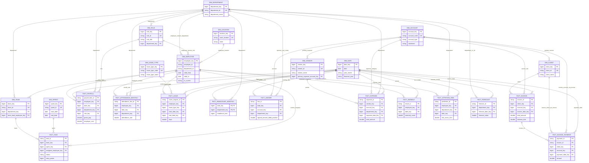

# PulseIQ star-schema ER diagram

```mermaid
erDiagram
    DIM_ACCOUNT {
        bigint account_key PK
        string account_code UK
        string account_type
        string statement
    }
    DIM_CLIENT {
        bigint client_key PK
        string client_id UK
        string client_name
    }
    DIM_DATE {
        bigint date_key PK
        date date
        string year_month
        string financial_year
    }
    DIM_DEPARTMENT {
        bigint department_key PK
        string department_id UK
        string department_name
    }
    DIM_EMPLOYEE {
        bigint employee_key PK
        string employee_id
        string department_id
        date valid_from
        date valid_to
        string is_current
    }
    DIM_LEAVE_TYPE {
        bigint leave_type_key PK
        string leave_type_code UK
        string leave_type_name
    }
    DIM_LOCATION {
        bigint location_key PK
        string work_location UK
        string state
    }
    DIM_ROLE {
        bigint role_key PK
        string role_id UK
        string role_title
        bigint department_key FK
    }
    DIM_SPRINT {
        bigint sprint_key PK
        string sprint_id UK
        date start_date
        date end_date
    }
    DIM_TEAM {
        bigint team_key PK
        string team_id UK
        bigint department_key FK
        bigint team_lead_employee_key FK
    }
    DIM_VENDOR {
        bigint vendor_key PK
        string vendor_id UK
        string vendor_name
        bigint primary_expense_account_key FK
    }
    FACT_PAYROLL {
        string payroll_item_id PK
        bigint employee_key FK
        bigint date_key FK
        bigint department_key FK
        bigint role_key FK
        double gross_pay
        double employer_cost
    }
    FACT_ATTENDANCE_MONTHLY {
        string attendance_fact_id PK
        bigint employee_key FK
        bigint date_key FK
        bigint department_key FK
        double attendance_rate
    }
    FACT_LEAVE {
        string leave_request_id PK
        bigint employee_key FK
        bigint leave_type_key FK
        bigint start_date_key FK
        bigint end_date_key FK
        double days
    }
    FACT_HEADCOUNT_MONTHLY {
        bigint date_key PK, FK
        bigint department_key PK, FK
        bigint headcount_end
    }
    FACT_LEDGER {
        string line_id PK
        bigint date_key FK
        bigint account_key FK
        bigint department_key FK
        double signed_amount_debit_positive
    }
    FACT_INVOICE {
        string invoice_id PK
        bigint client_key FK
        bigint account_key FK
        bigint invoice_date_key FK
        double total_amount
        double balance_due
    }
    FACT_INVOICE_PAYMENT {
        string payment_id PK
        string invoice_id FK
        bigint client_key FK
        bigint account_key FK
        bigint payment_date_key FK
        double amount
    }
    FACT_EXPENSE {
        string expense_id PK
        bigint vendor_key FK
        bigint account_key FK
        bigint department_key FK
        bigint expense_date_key FK
        double total_amount
    }
    FACT_TASK {
        string task_id PK
        bigint team_key FK
        bigint sprint_key FK
        bigint assignee_employee_key FK
        string status
        bigint story_points
    }
    FACT_ANOMALY {
        string result_id PK
        bigint employee_key FK
        bigint date_key FK
        double anomaly_score
    }
    FACT_ATTRITION_RISK {
        string prediction_id PK
        bigint employee_key FK
        bigint department_key FK
        bigint date_key FK
        double risk_score_12m
    }
    FACT_FORECAST {
        string forecast_id PK
        bigint department_key FK
        bigint forecast_date_key FK
        double forecast_value
    }

    DIM_EMPLOYEE ||--o{ FACT_PAYROLL : employee_version
    DIM_DATE ||--o{ FACT_PAYROLL : month_end
    DIM_DEPARTMENT ||--o{ FACT_PAYROLL : department
    DIM_ROLE ||--o{ FACT_PAYROLL : role
    DIM_EMPLOYEE ||--o{ FACT_ATTENDANCE_MONTHLY : employee_version
    DIM_DATE ||--o{ FACT_ATTENDANCE_MONTHLY : month_end
    DIM_DEPARTMENT ||--o{ FACT_ATTENDANCE_MONTHLY : department
    DIM_EMPLOYEE ||--o{ FACT_LEAVE : employee_version
    DIM_LEAVE_TYPE ||--o{ FACT_LEAVE : leave_type
    DIM_DATE ||--o{ FACT_LEAVE : start_date
    DIM_DATE ||--o{ FACT_LEAVE : end_date
    DIM_DATE ||--o{ FACT_HEADCOUNT_MONTHLY : month_end
    DIM_DEPARTMENT ||--o{ FACT_HEADCOUNT_MONTHLY : department
    DIM_DATE ||--o{ FACT_LEDGER : posting_date
    DIM_ACCOUNT ||--o{ FACT_LEDGER : account
    DIM_DEPARTMENT o|--o{ FACT_LEDGER : optional_cost_center
    DIM_CLIENT ||--o{ FACT_INVOICE : client
    DIM_ACCOUNT ||--o{ FACT_INVOICE : service_line
    DIM_DATE ||--o{ FACT_INVOICE : invoice_date
    FACT_INVOICE ||--o{ FACT_INVOICE_PAYMENT : invoice_id
    DIM_CLIENT ||--o{ FACT_INVOICE_PAYMENT : invoice_client_via_invoice
    DIM_ACCOUNT ||--o{ FACT_INVOICE_PAYMENT : invoice_account_via_invoice
    DIM_DATE ||--o{ FACT_INVOICE_PAYMENT : payment_date
    DIM_VENDOR ||--o{ FACT_EXPENSE : vendor
    DIM_ACCOUNT ||--o{ FACT_EXPENSE : expense_category
    DIM_DEPARTMENT ||--o{ FACT_EXPENSE : department
    DIM_DATE ||--o{ FACT_EXPENSE : expense_date
    DIM_TEAM ||--o{ FACT_TASK : team
    DIM_SPRINT ||--o{ FACT_TASK : sprint
    DIM_EMPLOYEE ||--o{ FACT_TASK : current_assignee
    DIM_EMPLOYEE ||--o{ FACT_ANOMALY : employee_at_period
    DIM_DATE ||--o{ FACT_ANOMALY : period
    DIM_EMPLOYEE ||--o{ FACT_ATTRITION_RISK : employee_version
    DIM_DEPARTMENT ||--o{ FACT_ATTRITION_RISK : department
    DIM_DATE ||--o{ FACT_ATTRITION_RISK : as_of_date
    DIM_DEPARTMENT ||--o{ FACT_FORECAST : department_or_all
    DIM_DATE ||--o{ FACT_FORECAST : forecast_month
    DIM_DEPARTMENT ||--o{ DIM_ROLE : department
    DIM_DEPARTMENT ||--o{ DIM_TEAM : department
    DIM_EMPLOYEE o|--o{ DIM_TEAM : team_lead
    DIM_ACCOUNT o|--o{ DIM_CLIENT : primary_service
    DIM_ACCOUNT o|--o{ DIM_VENDOR : primary_expense
    DIM_DEPARTMENT ||--o{ DIM_EMPLOYEE : employee_version_department
    DIM_ROLE ||--o{ DIM_EMPLOYEE : employee_version_role
    DIM_LOCATION ||--o{ DIM_EMPLOYEE : employee_location
```
